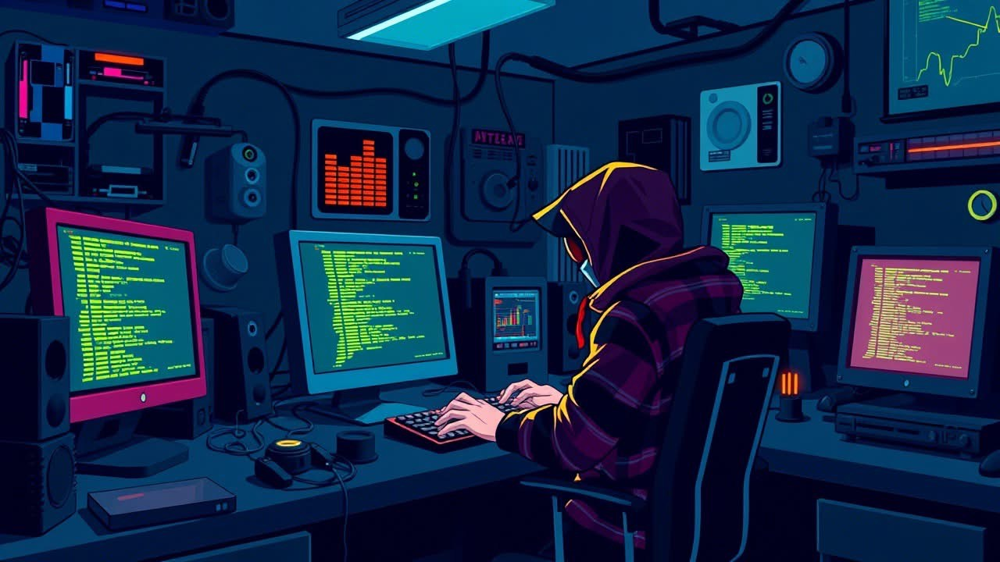

    
     
    

###

  
---

## 🎴 About me
Hello! I’m Juan Rengifo, a passionate software technologist and developer specialized in Full Stack Development. I create intelligent solutions that transform ideas into real, scalable technologies for the web, mobile, and cloud environments.

I’ve dedicated my career to building robust systems using modern technologies like React, Node.js, Python, databases, and APIs to solve real-world problems. My goal is to merge creativity and logic to develop impactful tools that empower people and businesses.

Beyond development, I actively contribute to the tech community, focusing on open-source projects and building software architectures that push the boundaries of what’s possible in the digital era.

---

## 🀄️ Languages | Frameworks & DB's |

    

---

### 📡 Conecta conmigo

  

---
