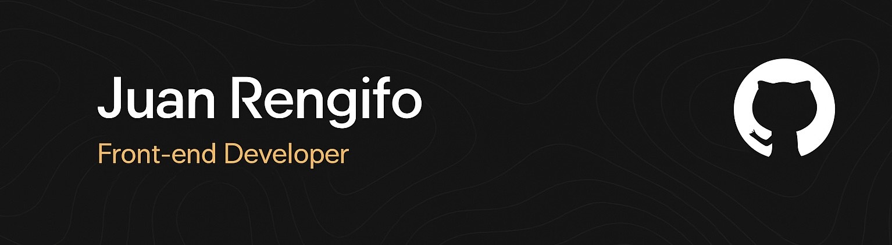

<h1 align="center">Hi 👋, I'm Juan!</h1>

###

<h3 align="center">🚀 Front-end Developer </h3>

###

⚡️ I'm 22 years old and I'm from Pereira, Colombia 🇨🇴

###

  

    
🔥 Portfolio Website:
   <a href="https://jrem08.github.io/David-website/" target="_blank">https://jrem08.github.io/David-website/</a>
      

  

###

<h3 align="left">Connect with me!</h3>

###

  
  

###

<h3 align="left">Skillset</h3>

###

 

    
 
 

 ###
 
 

    <a href="https://skillicons.dev">
     

###
